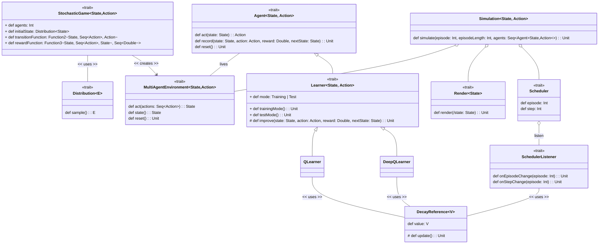

# Introduction to Multi-Agent Reinforcement learning (MARL)
## Code for ASMD seminar
This repository shows some basic examples of multi-agent reinforcement learning. It contains:
a) facades for the multi-agent environment and environment dynamics definition
b) interfaces for agents definition
c) implementation of Q learning and Deep Q learning
The MARL topic is really broad and consists of several algorithms and environment dynamics. 
For the interested ones, I suggest reading the papers listed in this repository: [https://github.com/LantaoYu/MARL-Papers](https://github.com/LantaoYu/MARL-Papers). 

Also, consider to read the following book: https://www.marl-book.com/
If you have any questions, please feel free to contact me at gianluca[dot]aguzzi[at]unibo[dot]it

## Structure

A `StochasticGame` extends an MDP (Markov Decision Process) to multi-agent systems, offering a framework for understanding the dynamics of a `MultiAgentEnvironment`. More details on Stochastic Games can be found [here](https://en.wikipedia.org/wiki/Stochastic_game). 

A `MultiAgentEnvironment` involves multiple `Agents` interacting within an environment and perceiving its `State`. If an `Agent` can improve itself through experience, it qualifies as a `Learner`.

To simulate a `MultiAgentEnvironment`, a `Simulation` is utilized. It conducts multiple runs, each defined by an `episodeLength`, using the specified agents.

### Examples
In this repository, I demonstrate two examples using the general structure outlined above:

- **Competitive Task, Rock Paper Scissors**: Two agents engage in the game of rock paper scissors. More details on this scenario are available [here](https://direct.mit.edu/isal/proceedings/alife2018/30/404/99610). I explore outcomes when both agents employ the same learning algorithm and scenarios where one agent has only partial observation of the environment. While a deeper discussion on equilibria and multi-agent dynamics would be beneficial, these topics are beyond the scope of this lesson. For further reading, consider the PhD thesis: [Many-agent Reinforcement Learning](https://discovery.ucl.ac.uk/id/eprint/10124273/).

- **Cooperative Task, Agent Alignment**: Here, `N` agents aim to align themselves either in a row or a column. This setup is inherently cooperative, as agents must work together to achieve the correct positioning. I discuss several common frameworks in cooperative tasks, including independent learners, team learning with a shared Q-table, and centralized learning. This serves as an introduction to "infinite" agent learning.

